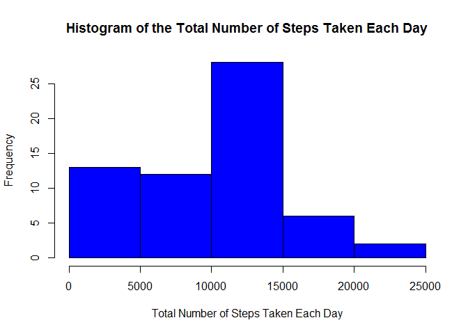
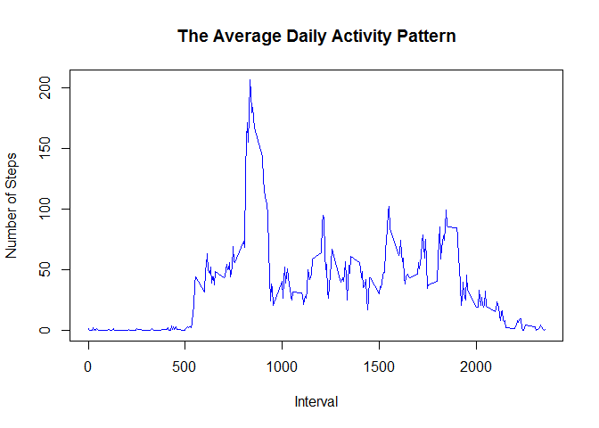
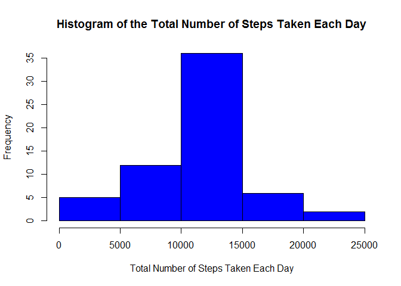

# Reproducible Research: Peer Assessment 1

##Loading and preprocessing the data
First make sure the data is in your working directory,load it into activity.Then convert date from Character to Date class.

```r
activity<-read.csv("activity.csv")
activity<-transform(activity,date=as.Date(as.character(date),"%Y-%m-%d"))
```
##What is mean total number of steps taken per day?
Here is a histogram of the total number of steps taken each day.


```r
totalnum<-tapply(activity$steps,as.factor(activity$date),sum,na.rm=TRUE)
hist(totalnum,col="blue",main=paste("Histogram of","the Total Number of Steps Taken Each Day"),xlab="Total Number of Steps Taken Each Day")
```

 

Here is the mean and median total number of steps per day.

```r
mean(totalnum)
```

```
## [1] 9354.23
```

```r
median(totalnum)
```

```
## [1] 10395
```
##What is the average daily activity pattern?
Here is a time series plot of the 5-minute interval (x-axis) and the average number of steps taken, averaged across all days (y-axis).

```r
actpattern<-tapply(activity$steps,as.factor(activity$interval),na.rm=TRUE,mean)
plot(names(actpattern),actpattern,type="l",col="Blue",main="The Average Daily Activity Pattern",xlab="Interval",ylab="Number of Steps")
```

 

```r
index<-names(which.max(actpattern))
max(actpattern)
```

```
## [1] 206.1698
```
The interval 835 has the maximum average number of steps 206.1698.

##Imputing missing values

Here is the total number of missing values in the dataset.

```r
totalna<-sum(is.na(activity$steps))
```

Then use the mean for that 5-minute interval across all days to fill the missing value and creat a new dataset "tidyactivity".

```r
tidyactivity<-activity
for(i in 1:nrow(activity)){
        if(is.na(activity[i,1]==TRUE)){
                tidyactivity[i,1]=mean(subset(activity,interval==activity[i,"interval"])[,1],na.rm=TRUE)
        }
}
```

Here is a histogram of the total number of steps taken each day with missing value filled.

```r
tidytotalnum<-tapply(tidyactivity$steps,as.factor(tidyactivity$date),sum,na.rm=TRUE)
hist(tidytotalnum,col="blue",main=paste("Histogram of","the Total Number of Steps Taken Each Day"),xlab="Total Number of Steps Taken Each Day")
```

 

Here is the mean and median total number of steps per day without missing value filled.

```r
mean(totalnum)
```

```
## [1] 9354.23
```

```r
median(totalnum)
```

```
## [1] 10395
```

Here is the mean and median total number of steps per day with missing value filled.

```r
mean(tidytotalnum)
```

```
## [1] 10766.19
```

```r
median<-median(tidytotalnum)
```
##Are there differences in activity patterns between weekdays and weekends?
Here is a panel plot containing a time series plot of the 5-minute interval (x-axis) and the average number of steps taken, averaged across all weekday days or weekend days (y-axis).

```r
library(lattice)
library(dplyr)
```

```
## 
## Attaching package: 'dplyr'
## 
## The following object is masked from 'package:stats':
## 
##     filter
## 
## The following objects are masked from 'package:base':
## 
##     intersect, setdiff, setequal, union
```

```r
Sys.setlocale("LC_ALL","C") ## The default language for my system is not English, so I have to make it right.
```

```
## [1] "C"
```

```r
tidyactivity<-mutate(tidyactivity,day=factor(1*(weekdays(date)=="Sunday"|weekdays(date)=="Saturday"),labels=c("weekday","weekend")))
sumdata<-aggregate(steps~interval+day,tidyactivity,mean)
xyplot(steps~interval|day,sumdata,xlab="Interval",ylab="Number of Steps",type="l",layout=c(1,2))
```

 
